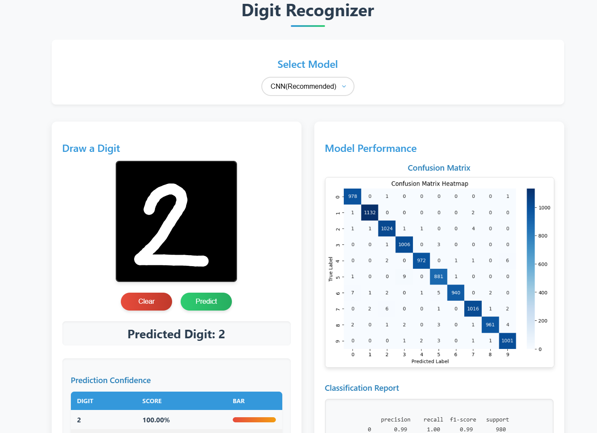
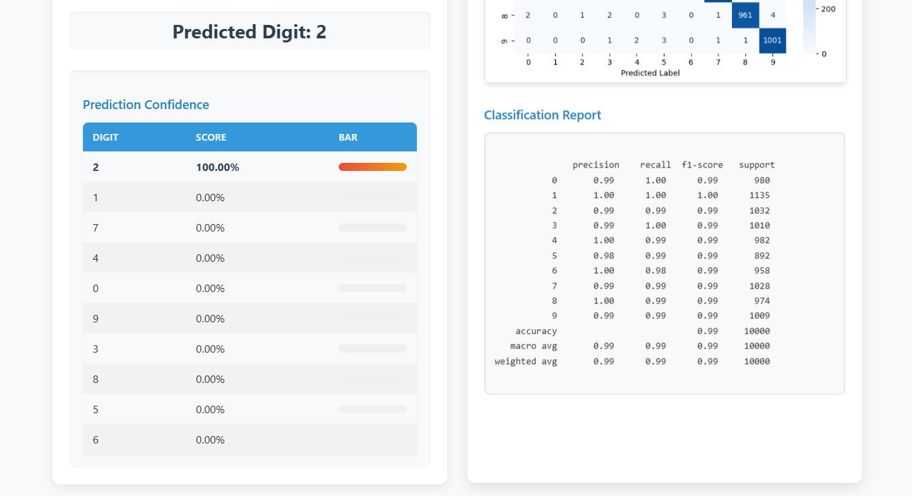

# Digit Recognizer Web App
---




## Overview
This is a **Flask-based web application** for **handwritten digit recognition** with models trained on the MNIST dataset. Users can select from multiple models and draw digits on a canvas to get predictions. The models are hosted on **Hugging Face** and integrated via an API.

## Features
- **Multiple Model Options:** Choose from **CNN (Recommended), SVM, Logistic Regression, and Random Forest**.
- **Model Insights:** View the **heatmap** and **classification report** for each model.
- **Canvas for Digit Input:** Users can draw digits on an interactive canvas.
- **Real-time Prediction:** The app predicts digits and provides accuracy scores.
- **Accuracy Chart:** Displays the accuracy of the predicted digits.
- **Hosted Models:** Models are served via an **API hosted on Hugging Face**.
- **Deployed Online:** Access the live demo at [Render Deployment](https://digit-recognizer-i0xj.onrender.com/).

## Live Demo
🔗 **Try it out here:** [Digit Recognizer Web App](https://digit-recognizer-i0xj.onrender.com/)

## Setup Instructions
To run the app locally, follow these simple steps:

1. **Clone the repository:**
   ```bash
   git clone <repository-url>
   cd Digit-recognizer
   ```

2. **Install dependencies:**
   ```bash
   pip install -r requirements.txt
   ```

3. **Run the Flask server:**
   ```bash
   python app.py
   ```

4. **Open in browser:**
   Navigate to `http://127.0.0.1:5000/` to access the web app.

## Model Information
- **Trained Models:** Available on [Google Drive](https://drive.google.com/drive/folders/1sJLjGXEB-lg3IV9cilm80wfyJ57NiRuj?usp=drive_link).
- **Training Scripts:** Also uploaded in the same [Google Drive folder](https://drive.google.com/drive/folders/1YvcqF_KYzmUYl8qf09H-wJH60LtuABra?usp=drive_link).
- **Accuracy Report:** Included in the repository as **"Accuracy Report"**.

## Usage Guide
🎥 **Watch the tutorial video here:** [Video Guide](https://drive.google.com/file/d/12X6XTIQIR9rA9E_0gTHYDIHmjLUvw_bN/view?usp=sharing)

## Technologies Used
- **Backend:** Flask, Python
- **Frontend:** HTML, CSS, JavaScript
- **ML Models:** CNN, SVM, Logistic Regression, Random Forest
- **Deployment:** Hugging Face (for models), Render (for web app)

## License
This project is open-source and available under the [MIT License](LICENSE).

---
### ⭐ Contributions & Feedback
Feel free to fork, contribute, or raise issues. Any feedback is highly appreciated!

